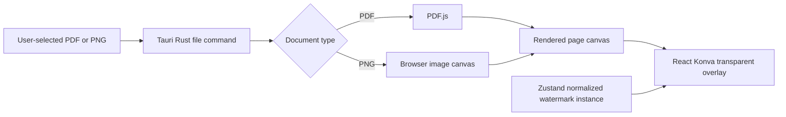
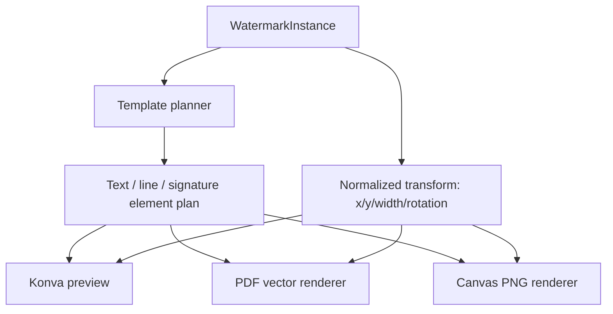
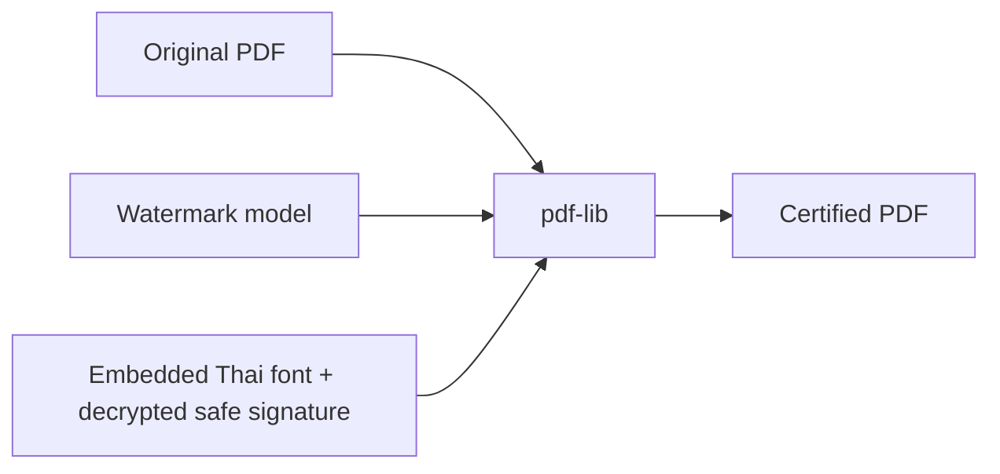
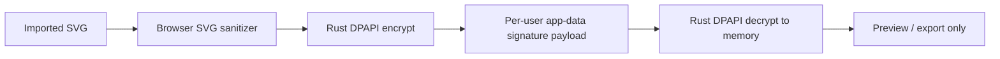

# Certified Copy architecture

## Import and preview

The imported bytes remain in memory only. The app does not copy source documents into application data or persist them on shutdown.

## Template and editor model

The planner has no React or PDF dependency. This keeps visual composition consistent while allowing each output medium to use its own renderer.

## Export

PDF export preserves the original PDF content stream and adds watermark operations. The original document is not rendered to an image. PNG output deliberately renders the page at the chosen resolution, then overlays the plan.

## Local security boundary

Metadata/settings are local JSON. Raw signature content is not stored as plaintext. CSP blocks network connections, and no backend or telemetry code is present.
