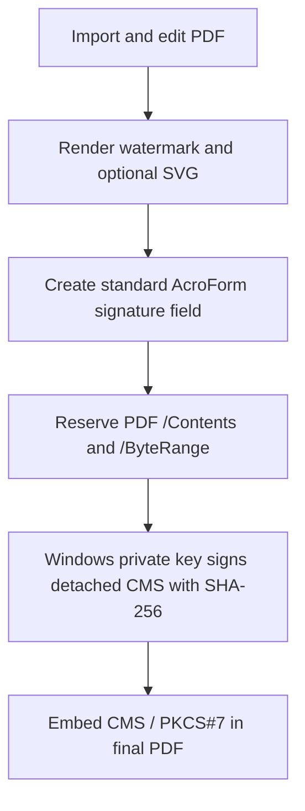

# Digital PDF signatures

EasySamnao has two different kinds of signature. They are intentionally shown separately.

| Feature                   | What it proves                                                                                      | What it does not prove                                                              |
| ------------------------- | --------------------------------------------------------------------------------------------------- | ----------------------------------------------------------------------------------- |
| Visible SVG signature     | A handwriting image was placed on the PDF                                                           | The signer identity, the certificate, or that the PDF remains unchanged             |
| Digital PDF signature     | The PDF bytes covered by the signature have not changed and were signed by the matching private key | That the signer is independently identified or trusted                              |
| Trusted digital signature | Integrity plus a certificate chain trusted by Windows                                               | The signer’s real-world role beyond what the certificate and trust policy establish |

## Signing flow

All EasySamnao visual edits finish before the signature field is prepared. The native backend signs the two PDF byte ranges with Windows CryptoAPI; private-key operations are never performed in the React renderer. The result uses a standard `adbe.pkcs7.detached` PDF signature field and can be checked by PDF tools that support standard detached CMS signatures. It is not password-encrypted, so recipients can open it directly.

After export, changing any bytes covered by `ByteRange` invalidates the signature. Further PDF incremental updates may add another compliant signature, timestamp, or validation data; EasySamnao’s verifier reports that later changes exist rather than claiming the document is unchanged.

## Visible SVG binding

When a certificate is bound to an SVG, EasySamnao stores the SVG ID and SHA-256 hash at the time of binding. It checks the current encrypted SVG payload immediately before a signed export.

- If it matches, the SVG may be used in the visible watermark.
- If it changed or is missing, signing with that visible SVG is blocked until the user explicitly re-binds it.
- A certificate may have no SVG binding. Signing without a visible SVG is valid.
- An SVG can be explicitly bound to more than one certificate.

The SVG artwork is visual only. Its hash is recorded to prevent accidental visual/certificate mismatches; it is not used as cryptographic signing input.

## Verification

EasySamnao reads each standard PDF `ByteRange`, asks Windows CryptoAPI to validate the detached CMS signature, and evaluates its included signer certificate through the Windows chain engine. It uses these precise messages:

- **Document integrity verified; certificate self-signed** — the PDF has not changed in the signed range, but the signer identity was not independently verified.
- **Document integrity verified; certificate trusted** — Windows could build a trusted chain.
- **Signature invalid / document modified** — CMS validation failed for the covered bytes.
- **Later incremental changes** — the older signature’s covered bytes validate, but the file contains later PDF changes.

Trust is not inferred from a handwriting SVG, a display name, or successful cryptographic verification alone.

## Timestamp and PAdES roadmap

The signing service is separate from certificate storage and the PDF renderer. RFC 3161 timestamping can be added as a signing-stage service that sends a digest—not the full PDF—to a configured TSA. OCSP, CRL, DSS, and PAdES-B-T/LT/LTA data are likewise future incremental updates. They are not currently claimed as present in EasySamnao exports.
