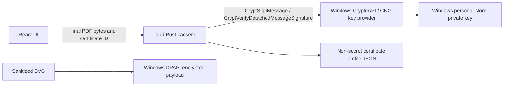

# Security model

## Boundaries

The renderer can request a signing operation but does not receive the private key, P12/PFX password, CMS private-key material, or certificate-store handle. Windows CryptoAPI creates and verifies the CMS/PKCS#7 containers; EasySamnao does not implement RSA, ECDSA, ASN.1, CMS, or certificate parsing itself.

## Input controls

- SVG imports are limited in size and passed through the graphics-only sanitizer before encryption and rendering.
- P12/PFX input is extension-checked, size-limited to 20 MB, and validated using Windows PKCS#12 APIs.
- PDF signature verification is size-limited to 200 MB and validates detached CMS through Windows rather than trusting PDF text alone.
- Export refuses to overwrite existing certificate or private-key export files.

## Flattened watermarks

Unsigned watermarked PDF pages are rendered at 300 DPI and embedded as a single image layer. This prevents a PDF editor from simply selecting and deleting a separate watermark text, line, or SVG object. Digitally signed exports keep the watermark as vector artwork: removing it remains possible, but invalidates the signature. Exports are not password-encrypted, so recipients can open them directly.

Flattening is a deterrent, not absolute copy protection: a determined party can still take screenshots, render pages, edit pixels, or create a new document. The final digital signature covers all signed content, so any alteration to the signed byte range is reported as a signature failure. Standard PDF copy/edit permissions require password-based encryption and can cause password prompts in common browser viewers, so they are not used for this openable distribution format.

## Secrets

- Generated keys stay in the Windows certificate store and are non-exportable by default.
- P12/PFX passwords are passed only to the native import/export command, are not written to settings or metadata, and are zeroed where the backend retains an owned value.
- The app has no telemetry, backend, or runtime network connection. A future timestamp authority feature must send only the RFC 3161 digest, never a private key or full PDF unless a TSA protocol explicitly requires otherwise.

## Limitations and honest wording

A cryptographically valid signature verifies document integrity for the signed byte range. It does not by itself establish real-world identity. A self-signed certificate is reported as self-signed even when its PDF integrity check succeeds. EasySamnao currently supports standard detached CMS signatures; RFC 3161 timestamps and PAdES-LTV material are planned extensions, not features represented in current exports.
